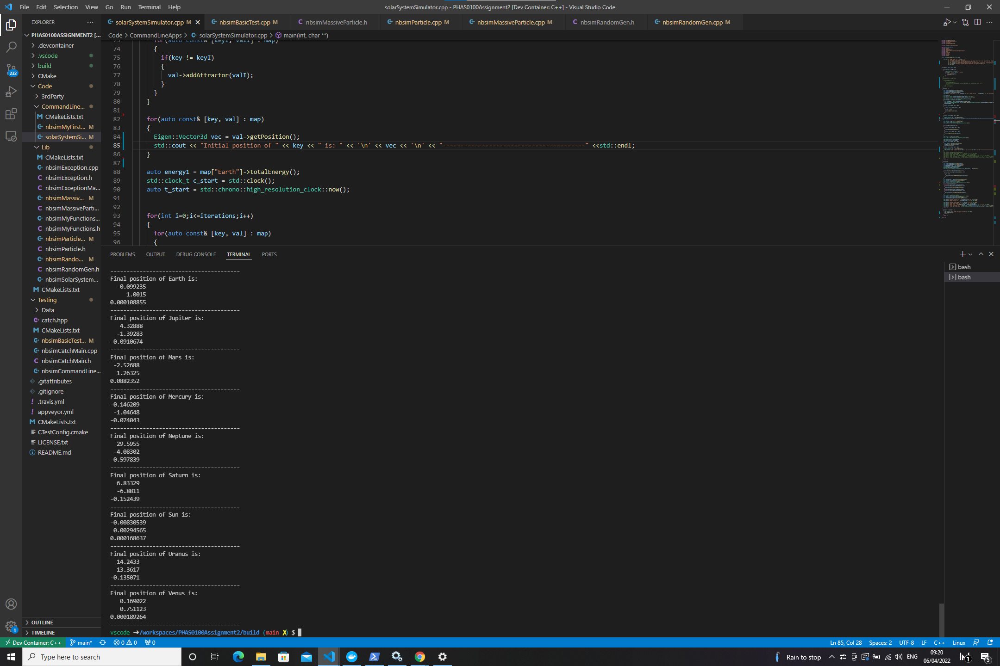

PHAS0100Assignment2
------------------

[](https://travis-ci.com/[USERNAME]/PHAS0100Assignment2)
[](https://ci.appveyor.com/project/[USERNAME]/PHAS0100Assignment2)


Purpose
-------

This project serves as a starting point for the PHAS0100 Assignment 2 Gravitational N-body Simulation coursework. It has a reasonable folder structure for [CMake](https://cmake.org/) based projects,
that use [CTest](https://cmake.org/) to run unit tests via [Catch](https://github.com/catchorg/Catch2). 

Further information on the specific project is left as an exercise for the student.


Credits
-------

This project is maintained by [Dr. Jim Dobson](https://www.ucl.ac.uk/physics-astronomy/people/dr-jim-dobson). It is based on [CMakeCatch2](https://github.com/UCL/CMakeCatch2.git) that was originally developed as a teaching aid for UCL's ["Research Computing with C++"](http://rits.github-pages.ucl.ac.uk/research-computing-with-cpp/)
course developed by [Dr. James Hetherington](http://www.ucl.ac.uk/research-it-services/people/james)
and [Dr. Matt Clarkson](https://iris.ucl.ac.uk/iris/browse/profile?upi=MJCLA42).


Build Instructions
------------------

This project was developed using Ubuntu 20.04 docker image, using the g++ 9.3.0 complier(enforcing C++ 17) and CMake 3.16.3.
To run this project make sure the same environment is used.

The git repository must be extracted from the zip file. 
To build this application you must run the following bash commands inside the PHAS0100Assignment2 folder:

1. Creating build directory to build cmake project inside
  ```sh
   mkdir build
   ```
2. Moving into the build directory
   ```sh
   cd build
   ```
3. Running cmake, [https://cmake.org/documentation/]
   ```sh
   cmake ..
   ```
4. making the project
   ```sh
   make
   ```

<p align="right">(<a href="#top">back to top</a>)</p>


Testing Solar system application
---------------------------------
This section corresponds to the part of the assingment that asks for the simulation of the solar system for 1 year using a timestep of 0.000274 (which corresponds to 0.1 days). The results for this seen in the png that follows:
!Getting Started](Results/images/glider.png)




