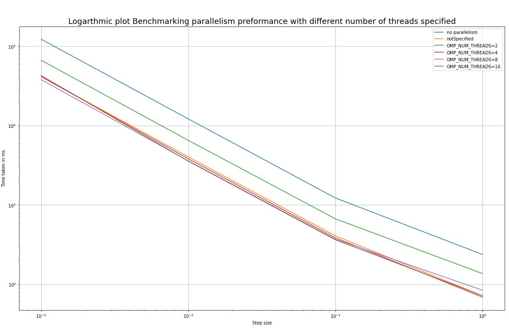

PHAS0100Assignment2
------------------

[](https://travis-ci.com/[USERNAME]/PHAS0100Assignment2)
[](https://ci.appveyor.com/project/[USERNAME]/PHAS0100Assignment2)


Purpose
-------

This project serves as a starting point for the PHAS0100 Assignment 2 Gravitational N-body Simulation coursework. It has a reasonable folder structure for [CMake](https://cmake.org/) based projects,
that use [CTest](https://cmake.org/) to run unit tests via [Catch](https://github.com/catchorg/Catch2). 

Further information on the specific project is left as an exercise for the student.


Credits
-------

This project is maintained by [Dr. Jim Dobson](https://www.ucl.ac.uk/physics-astronomy/people/dr-jim-dobson). It is based on [CMakeCatch2](https://github.com/UCL/CMakeCatch2.git) that was originally developed as a teaching aid for UCL's ["Research Computing with C++"](http://rits.github-pages.ucl.ac.uk/research-computing-with-cpp/)
course developed by [Dr. James Hetherington](http://www.ucl.ac.uk/research-it-services/people/james)
and [Dr. Matt Clarkson](https://iris.ucl.ac.uk/iris/browse/profile?upi=MJCLA42).


Build Instructions
------------------

This project was developed using Ubuntu 20.04 docker image, using the g++ 9.3.0 complier(enforcing C++ 17) and CMake 3.16.3.
To run this project make sure the same environment is used.

The git repository must be extracted from the zip file. 
To build this application you must run the following bash commands inside the PHAS0100Assignment2 folder:

1. Creating build directory to build cmake project inside
  ```sh
   mkdir build
   ```
2. Moving into the build directory
   ```sh
   cd build
   ```
3. Running cmake, [https://cmake.org/documentation/]
   ```sh
   cmake ..
   ```
4. making the project
   ```sh
   make
   ```

<p align="right">(<a href="#top">back to top</a>)</p>

Resutls
-----------
All the results that follow were timed using 
std::chrono::high_resolution_clock

<p align="right">(<a href="#top">back to top</a>)</p>

Testing Solar system application
---------------------------------
To recreate these results one would need to run:
```sh
./bin/solarSystemSimulator 
```
With two inputs:
1. The size of the time step as a double
2. The number of years the solar system should be simulated for
3. 
This section corresponds to the part of the assingment that asks for the simulation of the solar system for 1 year using a timestep of 0.000274 (which corresponds to 0.1 days). The results for this seen in the png that follows:


<p align="right">(<a href="#top">back to top</a>)</p>

Testing Solar system application for 100 years
---------------------------------
To recreate these results one would need to run:
```sh
./bin/solarSystemSimulator 
```
With two inputs:
1. The size of the time step as a double
2. The number of years the solar system should be simulated for

To test the application solarSystem application we can look at the results of simulating the solar system for 100 years with different step sizes for the time step. The varience in the step size is made as there is a very simple integration scheme that governs the dynamics of the system being investiged.
The specific scenario the is tested is running the solar system for 100 years with step sizes ranging from 0.1 -> 0.0000001.
The resutls can be seen in the following .JPG:


These results are not very reprsentative so a loglog graph is used below to better visulaize the resutls.


From these resutls we can clearly see that on the logarithmic graphs both the error and time complexity results in a straight line, leading to the conclusion that the computational complexity of decreacing the step size is of order O(n^2).  
<p align="right">(<a href="#top">back to top</a>)</p>

Testing Solar system application for Random particles
---------------------------------
This section is made to test the integration of the random particle generator class with the rest of the code, that being the MassiveParticle class and the parent Particle class. For the initialisation of the random particels some stable equations of motion are used as seen in the assingment pdf. For this simulation to be stable and avoid decaying orbits and other issues a massive paritlce is initialised first with a much larger value of mu than the rest of the particles so we can simulate the oribits of many particles around one central object.
To recreate these results one would need to run:
```sh
./bin/solarSystemSimulator 
```
With three inputs:
1. The size of the time step as a double
2. The number of years the solar system should be simulated for
3. The number of random initial particles to be made

In this section the code is being tested for the initialization of random particles and then the parallelisation of the code.
Some basic initial parallelization for the loops that calcualte the acceleration and the timestep function was made and then this was benchmarked against no parallelization. The same graph of time versus stepsize was made but for a different number of specified threads. Using OMP_NUM_THREADS= the number of threads checked were 2,4,8,16:



As we can see from the graph that the parallelization does lead to some speedup in the simulation time when comparing the original to and number of threads. The current machine used for these simulations has 4 cores and as such there is no preformance boost seen when specifing a number of threads above 4. This difference can clearly be seen when comparing with OMP_NUM_THREADS=2 as there is a clear preformance difference.

In the assingment breif there is a suggestion made for the reduction of some for loops due to the computation of the energy possibly becoming a bottleneck to the computation, this has been done. However it cannot be comared to the resutls above as the timing was done for the calcualtion of the acceleraion and the timeStep only. This was done to measure the direct effect of the pallelism of the two main for loops.

However new benchmarking for the reduction of the energy for loops results in the following:

<p align="right">(<a href="#top">back to top</a>)</p>
